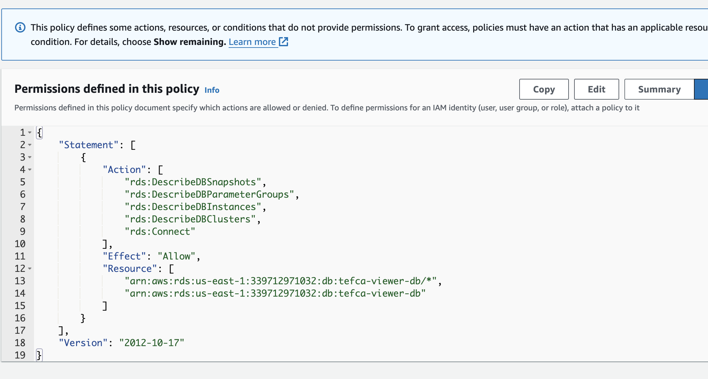
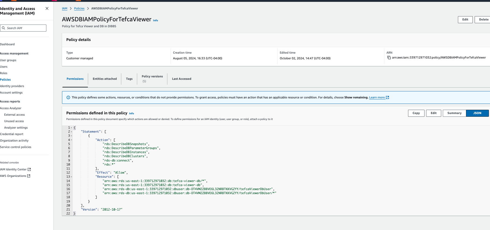
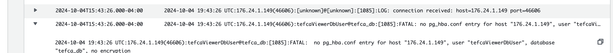
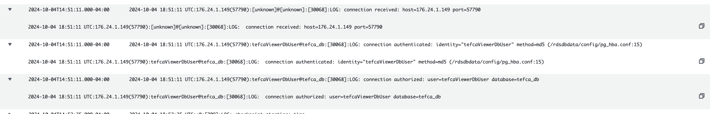

There were multiple configurations that prohibited the EKS tefca viewer pod from connecting to the Postgres database. 

1. The EKS clusterwas missing the required IAM permissions (add to phdi-playground repo)
    1. 
    - Original policy had  `rds:Connect` as an action it was creating the error `Invalid Action: The action rds:Connect does not exist`
     

    - Modified Policy : This policy replaced rds:Connect with rds-db:Connect and the resource block to reference the database with the Resource ID
     

2. In the parameter group for the database, rds.force_ssl was enabled and only allows SSL connections.
    - I disable the parameter by changing the value to 0
    
    The fix is sufficient to allow the connection between the pod and RDS.
    
    - Log with error message:
    

    - Log after making changes above:
        - In the snapshot, I can verify that the database is connecting based off of the 3 entries that show connection received, connection authenticated, and connection authorized
    

3. To better assist with troubleshooting in the future, I made the change below:
    -  I turned on Postgres logging for the RDS database to help with debugging the issue

